# Observability

## Need for observability

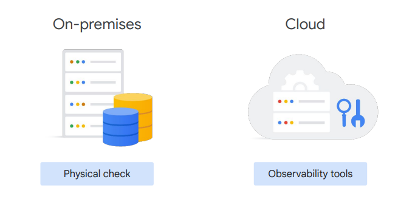

1. Visibility into system health : Help me understand my application and tell me if its healthy
    - are my systems functioning?
    - do my systems havesufficient resources available?”

2. Error reporting and alerting: Bring my attention directly to problems
    - proactive alerting, anomaly detection, or guidance on issues.
    - Ideally, they want to avoid connecting the dots themselves.

3. Efficient troubleshooting: Help me fix it if its broken
    - If possible, the service needs to be opinionated about the potential cause of the issue and recommend a meaningful direction for the customer to start their investigation

4. Improve performance: Guide me to optimize it
    - Users need a service that can perform retrospective analysis.
    - Generally, help them plan intelligently by analyzing trends and understand how changes in the system affect its performance.

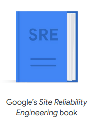

- [sre - books](https://sre.google/books/)

Collecting, processing, aggregating, and displaying real-time quantitative data
about a system, such as

- query counts and types
- error counts and types,
- processing times
- server lifetimes

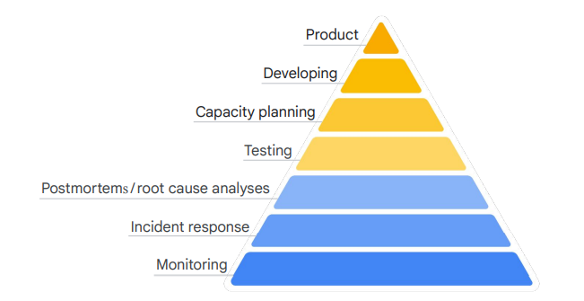

- However, to be truly reliable, even the very best products still must be deployed into environments with enough ``capacity`` to handle the anticipated client load.

- Great products also need thorough ``testing``, preferably automated testing, and a
refined ``continuous integration/continuous development (CI/CD)`` release pipeline.

- ``Postmortems`` and ``root cause analyses`` are the DevOps team's way of letting the client
know why an incident happened and why it is unlikely to happen again.

    > In DevOps, postmortems are structured, blameless analyses of incidents or failures, conducted to understand what happened, identify root causes, and implement corrective actions to prevent recurrence.

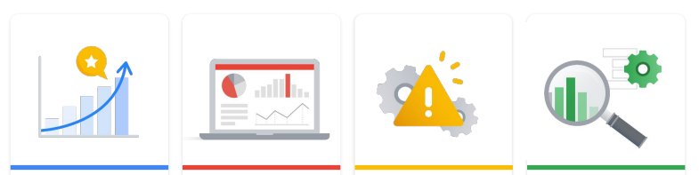

- Continual improvement
- Dashboards
- Automated alerts
- Incident response

We need ``automated alerts`` because humans tend to look at things only when there's
something important to look at. An even better option is to construct ``automated
systems`` to handle as many alerts as possible so humans only have to look at the
most critical issues.

Typically, there's some triggering event: a ``system outage``, ``data loss``, a ``monitoring
failure``, or some form of manual intervention. The trigger leads to a response by both
``automated systems`` and ``DevOps personnel``.

Many times the response starts by examining signal data that comes in through
monitoring. The impact of the issue is evaluated and escalated when needed, and an
initial response is formulated. Throughout, good SREs will strive to keep the customer
informed and respond when appropriate.

## Four Golden Signals

### Latency

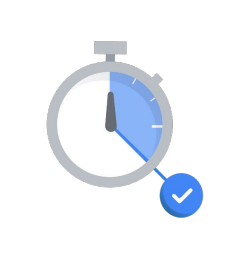

Latency measures how long it takes a particular part of a system to return a result.

Latency is important because:

1. It directly affects the user experience.
2. Changes in latency could indicate emerging issues.
3. Its values may be tied to capacity demands.
4. It can be used to measure system improvements.

But how is it measured? Sample latency metrics include:

    - Page load latency
    - Number of requests waiting for a thread
    - Query duration
    - Service response time
    - Transaction duration
    - Time to first response
    - Time to complete data return

### Traffic

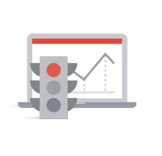

Traffic measures how many requests are reaching your system.

Traffic is important because:

1. It’s an indicator of current system demand.
2. Its historical trends are used for capacity planning.
3. It’s a core measure when calculating infrastructure spend.

Sample traffic metrics include:

    - # HTTP requests per second
    - # requests for static vs. dynamic content
    - Network I/O
    - # concurrent sessions
    - # transactions per second
    - # retrievals per second
    - # active requests
    - # write ops
    - # read ops
    - And # active connections

### Saturation

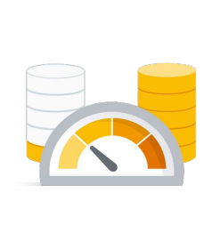

Saturation, which measures how close to capacity a system is. It’s important to note, though, that capacity is often a subjective measure, that depends on the underlying service or application.

Saturation is important because:

1. It's an indicator of current system demand. In other words, how full the service is.
2. It focuses on the most constrained resources.
3. It’s frequently tied to degrading performance as capacity is reached.

Sample capacity metrics include:

    - % memory utilization
    - % thread pool utilization
    - % cache utilization
    - % disk utilization
    - % CPU utilization
    - Disk quota
    - Memory quota
    - # of available connections
    - And # of users on the system

### Errors

Errors, which are events that measure system failures or other issues. Errors are often raised when a flaw, failure, or fault in a computer program or system causes it to produce incorrect or unexpected results, or behave in unintended ways.

Errors might indicate:

1. Configuration or capacity issues
2. Service level objective violations
3. That it's time to emit an alert

Sample error metrics include:

    - Wrong answers or incorrect content
    - # 400/500 HTTP codes
    - # failed requests
    - # exceptions
    - # stack traces
    - Servers that fail liveness checks
    - And # dropped connections

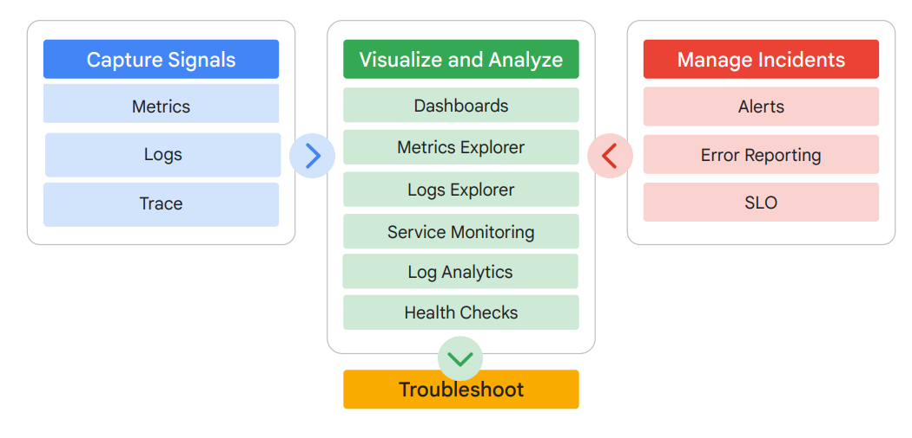

- The signal data flows into the Google Cloud operation's tools where it can be
visualized in dashboards and through the Metrics Explorer.
- Automated and custom logs can be dissected and analyzed in the Logs
Explorer.
- Services can be monitored for compliance with service level objectives (SLOs),
and error budgets can be tracked.
- Health checks can be used to check uptime and latency for external-facing
sites and services.

When incidents occur:

- Signal data can generate automated alerts to code or, through various
information channels, to key personnel.
- Error Reporting can help operations and developer teams spot, count, and
analyze crashes in cloud-based services.
- The visualization and analysis tools can then help troubleshoot what's
happening in Google Cloud.

## Cloud Monitoring

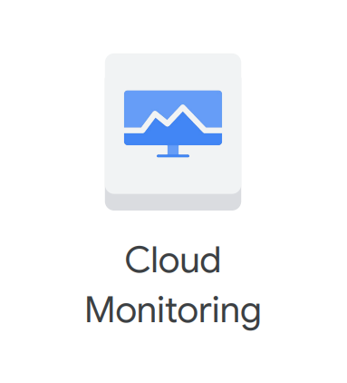

Cloud monitoring provides visibility into the ``performance``, ``uptime``, and ``overall health`` of cloud-powered applications.

It collects ``metrics``, ``events``, and ``metadata`` from ``projects``, ``logs``, ``services``, ``systems``, ``agents``, ``custom code``, and various common application
components, including Cassandra, Nginx, Apache Web Server, ``Elasticsearch``, and
many others.

Monitoring ingests that data and generates insights via dashboards, Metrics Explorer
charts, and automated alerts.

### Cloud Monitoring Features

- **Automatic, free ingestion:** On 100+ monitored resources, over 1,500 metrics
are immediately available with no cost
- **Open Source Standards:** Leverage [Prometheus](https://prometheus.io/) and [OpenTelemetry](https://opentelemetry.io/) to collect
metrics across compute workloads
- **Customization for key workloads:** Cloud Monitoring offers custom visualization
capabilities for GKE through Google Cloud Managed Service for ``Prometheus``
and for Google Compute Engine through [Ops Agent](https://cloud.google.com/stackdriver/docs/solutions/agents/ops-agent).
- **In-context visualizations & alerts:** View relevant telemetry data alongside your
workloads across Google Cloud.

## Cloud Logging

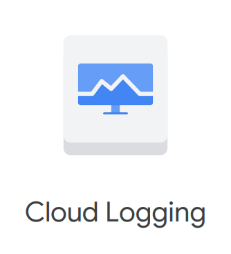

- **Automatic, easy log ingestion:** Immediate ingestion from GCP services
across your stack
- **Gain insight quickly:** Tools like ``Error Reporting``, ``Log Explorer``, and ``Log
Analytics`` let you quickly focus from large sets of data
- **Customize routing & storage:** Route your logs to the region or service of
your choice for additional compliance or business benefits
- **Compliance Insights:** Leverage ``audit`` and app logs for compliance patterns
and issues

- Google's Cloud Logging allows users to ``collect``, ``store``, ``search``, ``analyze``, ``monitor``, and ``alert`` on log entries and events.

  - Automated logging is integrated into Google Cloud products like ``App Engine``, ``Cloud Run``, ``Compute Engine VMs`` that run the logging agent, and ``GKE``.
  - You can aggregate and centralize logs at a organizational level, project level and folder level based on your needs.

- Most log analysis start with Google Cloud’s integrated Logs Explorer.

  - Logging entries can also be exported to several destinations for alternative or further analysis.
  - Export log data as files to ``Google Cloud Storage``, or ``as messages through Pub/Sub``, or ``into BigQuery tables``.
  - Pub/Sub messages can be analyzed in near-real time using ``custom code`` or stream processing technologies like ``Dataflow``.
  - ``BigQuery`` allows analysts to examine logging data through ``SQL queries``.
  - And archived log files in Cloud Storage can be analyzed with several tools and techniques.
  - ``Logs-based metrics`` may be created and integrated into Cloud Monitoring dashboards, alerts, and service SLOs.

- Default log retention in Cloud Logging depends on the log type. 

  - ``Data access logs`` are retained by default for ``30 days``, but this is configurable up to a ``max of 3650 days``.
  - ``Admin logs`` are stored by default for ``400 days``.
  - Export logs to ``Google Cloud Storage`` or ``BigQuery`` to ``extend retention``.

- **Get started quickly –** Out-of-the-box collection of system metrics and logs
- **Use logging SDKs and library –** Integration into popular SDKs to support rich log formatting
- **Analyze log in real-time:** Analyze log data in real-time, debug code, troubleshoot your apps
- **Find errors quickly –** Find errors via stack traces automatically with Error Reporting

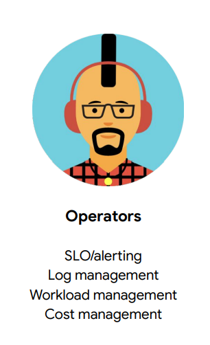

- **Collect the right telemetry –** Instrumentation for GCE, on-prem and other cloud providers
- **Centralize logs –** Centralize logs for specific users, teams and/or organizations
- **Manage logs –** Set retention periods, select supported regions for regional data storage
- **Set alerts –** Understand log volume/cost, set alerts on important application metrics
- **Export logs –** Export to Google Cloud for storage, analysis, integrate with 3rd parties

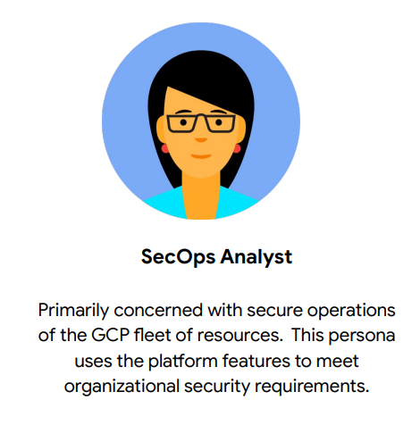

- **Collect audit logs –** Collect Google Cloud audit logs by default, advanced security logs such as data access logs
- **Collect network telemetry data –** Collect and analyze VPC flow logs, GKE network, firewall, load balancer logs
- **Analyze logs for security events –** View audit logs and other events to investigate possible security events

## Error Reporing

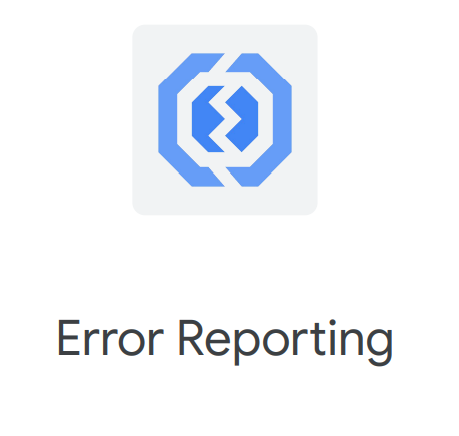

Error Reporting counts, analyzes, and aggregates the crashes in your running cloud
services.

- **Real time processing:** Application errors are processed and displayed in the
interface within seconds.
- **Quickly view and understand errors:** A dedicated page displays the details of
the error: bar chart over time, list of affected versions, request URL and link to
the request log.
- **Instant notification:** Do not wait for your users to report problems. 
  - Error Reporting is always watching your service and instantly alerts you when a new application error cannot be grouped with existing ones. 
  - Directly jump from a notification to the details of the new error.

> You can also create alerts to receive notifications on new errors

## Application Performance Management `APM`

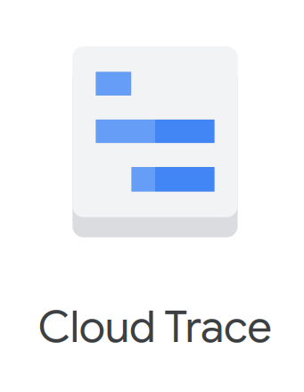

