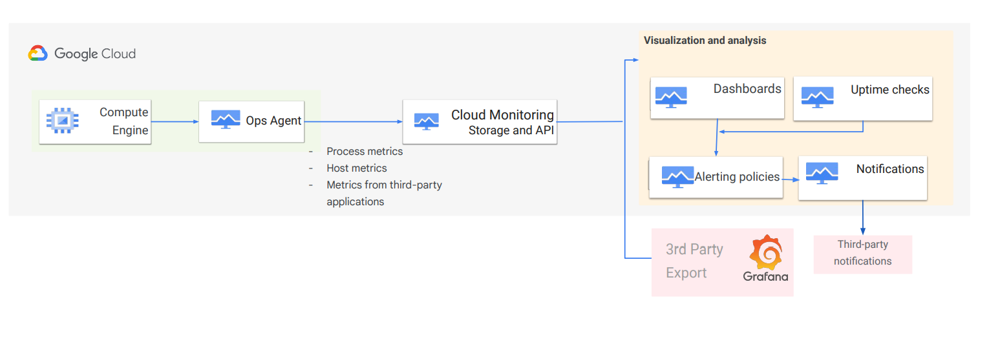
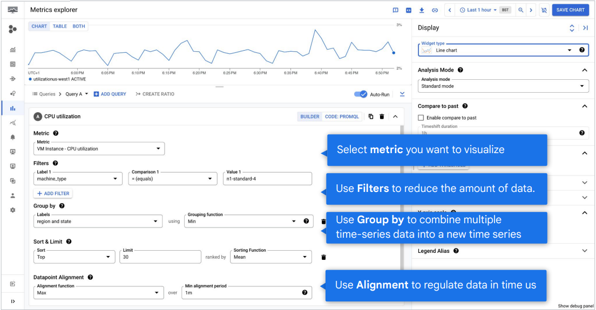

# Monitoring

The DevOps Resource and Assessment [DORA](https://cloud.google.com/devops?hl=en) research program defines
monitoring as:

> "The process of `collecting`, `analyzing`, and using information to track applications and infrastructure in order to guide business decisions. Monitoring is a key capability because it gives you insight into your systems and your work."

- Monitoring is the foundation of product reliability

## Cloud Monitoring Architecture

A typical Cloud Monitoring architecture includes the following:

- **A data collection layer:** This layer collects `metrics`, `logs`, and `traces` from cloud-based systems.
  - In Cloud Monitoring, the data collection layer includes **Google Cloud services** such as `Google Kubernetes Engine`, `Google Compute Engine`, `App Engine` etc,.

- **A data storage layer:** This layer `stores` the collected data and `routes` to the configured `visualization and analysis layer`.
  - In Cloud Monitoring, this layer includes the `Cloud Monitoring API` that helps triage the metrics collected to be stored for further analysis.

> The term **triage** generally refers to the process of prioritizing tasks, issues, or items based on their urgency and importance. In software development and project management, triage is commonly used to describe the systematic review and categorization of bugs, feature requests, or support tickets. The goal is to ensure that the most critical problems are addressed first, resources are allocated efficiently, and less urgent issues are scheduled appropriately. Triage helps teams maintain focus, improve response times, and manage workloads effectively.

- **A data analysis and visualization layer:** This layer `analyzes` the collected data to identify problems and trends and presents the analyzed data in a way that is easy to understand.
  - In Cloud Monitoring, this layer comprise of various features within Cloud Monitoring such as `Dashboards` to visualize data, `Uptime checks` to monitor applications, `Alerting policies` to configure alerts and notifications to notify of events that need attention.

### Platform Monitoring

- One of the most common uses of Cloud Monitoring is platform monitoring
`Blackbox monitoring` of the platform enables users to get visibility into the
performance of their Google Cloud services.
- With Google Cloud, this is enabled by default and system metrics are automatically collected without any user effort.
- Google Cloud Monitoring is the recommended solution for Platform monitoring.

- System metrics from Google Cloud are available at no cost to customers.
  - These metrics provide information about how the service is operating.
  - `Over 1500 metrics` across `more than 100 Google Cloud services` automatically.
    - For example, Compute Engine reports over 25 unique metrics for each virtual machine (VM) instance.
    - However, if customers, e.g. in traditional enterprise cohorts, are using 3P products for monitoring and want to aggregate their Google Cloud metrics into those partner products, they can use Cloud Monitoring APIs to ingest these metrics.

### Application Monitoring - GKE

- For applications/workloads deployed in GKE, many customers prefer a `Prometheus-based` solution for monitoring.
  - We fully embrace that monitoring approach and provide customers a new way to leverage Prometheus based monitoring using `Google Managed Prometheus (GMP)`.
  - GMP is a part of Cloud Monitoring and it makes GKE cluster and workload metrics available as Prometheus data.
  - It can `ingest monitoring data` exposed in Prometheus format, it supports `PromQL` compatible query language and has natively integrated the Prometheus `expression browser`, and Prometheus compatible `rule evaluation`.
  
- For application workloads in GKE, we recommend that customers use Google Managed Prometheus.

### Application Monitoring - Compute Engine

- For applications or workloads deployed in Compute Engine, customers should use the `Cloud Ops Agent` to collect in-process metrics and to collect metrics from 3rd party
applications that run in your VMs.
- Ops agent today supports `more than 30 plugins` for different `open source and ISV software` along with a collection of richer and more fine grained metrics at the `OS level` for Windows and Linux (many flavors).
- The Ops agent is based on `OpenTelemetry standards` so custom applications developed by
customers can leverage `OTEL client libraries` for `instrumenting` their code and generate the needed telemetry.

> **Instrumenting** refers to the process of adding code or tools to an application or system to collect data about its behavior and performance. In the context of monitoring, instrumenting typically involves integrating libraries, agents, or APIs that generate metrics, logs, or traces as the application runs. This data helps developers and operators gain visibility into how the system is functioning, identify bottlenecks or errors, and make informed decisions for optimization and troubleshooting. Instrumenting is a foundational step for effective observability and monitoring in modern software systems.

- The `Ops agent` can `collect` these custom metrics and make them available in `Cloud
Monitoring` as well.
  - While this ecosystem of 3P plugins will continue to expand, if users need support for other software products or services, consider using a partner product like `Datadog` or `NewRelic`.
  - If you choose to use partner products, they can collect system metrics from the Google Cloud platform by using the `native API-based integrations`.

### Hybrid monitoring and logging

With Google's partner `BindPlane` by `Blue Medora`, you can import monitoring and
logging data from both `on-premises VMs` and other `cloud providers`, such as `Amazon
Web Services (AWS)`, `Microsoft Azure`, `Alibaba Cloud`, and `IBM Cloud` into Google
Cloud.

- The following diagram shows how Cloud Monitoring and BindPlane can provide a single pane of glass for a hybrid cloud.
  - This architecture has the following advantages:
    - In addition to monitoring resources like VMs, Blue Medora has built-in deep integration for over 150 popular data sources.
    - There are no additional licensing costs for using BindPlane. BindPlane metrics are imported into Monitoring as custom metrics, which are chargeable. Likewise, BindPlane logs are charged at the same rate as other Cloud Logging logs.

## Monitoring Multiple projects

When you go to monitoring settings for a project, you can see that the current
metrics scope only has a single project in it, the one it is currently viewing.
Let's have a look at metrics scopes and how they work. When you create a
Google Cloud project, that project hosts a metrics scope and becomes the
scoping project for that scope.
It stores the alerts, uptime checks, dashboards, and monitoring groups that you
configure for the scope. For example, if you create a staging project and then
access monitoring, you can see the metrics for the resources in the staging
project.
This happens for every project you create. Each project creates a metrics scope
for itself and hosts monitoring configuration for itself. But what if you want to
centralize how that data is stored and how it's accessed?
 Since it's possible for one metrics scope to monitor multiple projects, and also a
project can be monitored from only a single metrics scope, you will have to decide
which relationship will work best for your organizational culture, and this particular
project.

### Strategy A: Every project is monitored locally, in that project

Advantages:

- Clear and obvious separation for each project.
  - If the project contains development-related resources, it's easy to provide access to the dev personnel.
- Project resources and monitoring resources all in the same place.
- Easy to automate, since monitoring becomes a standard part of the initial project setup.

Disadvantages:

- If the application is larger than a single project, you will have limited visibility into application performance.

### Strategy B: Single metrics scope for large units of projects, probably an application or application part

- You can add multiple projects to an existing scope.
  - Now, monitoring data for all projects in that scope will be visible.
  - This will let you create dashboards, showing resources from all the projects in the scope, or alerting policies that apply to resources in multiple projects as long as they're in the metrics scope.

> Note that the recommended approach for production deployments is to create a dedicated project to host monitoring configuration data and use its metrics scope to set up monitoring for the projects that have actual resources in them.

> This way, should a project not be necessary anymore and get deleted, the monitoring configuration for all the other projects won't be impacted.

Advantages:

- Single pane of glass that provides visibility into the entire group of related projects.
- Compare non-prod and prod environments easily.

Disadvantages:

- Anyone with IAM permissions to access Cloud Monitoring will be able to see metrics for all environments.
- Monitoring in prod is typically divided among different teams. This approach would not preserve that separation.

> Although the metric data and log entries remain in the individual projects, any user
who has been granted the role `Monitoring Viewer (roles/monitoring.viewer)` will have
access to the dashboards and have access to all data by default.

> This means that a role assigned to one person on one project applies equally to all projects monitored by that metrics scope.

Remember, metrics scope only affects and controls Google Cloud resources related
to `Cloud Monitoring`.

Other tools covered in this course, such as `Cloud Logging`, `Error Reporting`, and the
`Application Performance Management (APM) tools`, are strictly `project-based` and do not rely upon the configuration of the metrics scope or the monitoring IAM roles.

## Cloud Monitoring Data Model

In general terms, monitoring data is recorded in time series.
Each individual time series includes four pieces of information relevant to this discussion:

- The ``metric`` field describes the metric itself and records two aspects:
  - The ``metric-label`` that represents one combination of label values.
  - The ``metric type`` specifies the available labels and describes what is represented by the data points.
- The ``resource`` field records:
  - The ``resource-label`` represents one combination of label values.
  - The **specific monitored resource** from which the data was collected.

- The ``metricKind`` and ``valueType`` fields tell you how to interpret the values.
  - The value type is the ``data type`` for the measurements.
  - Each time series records the value type (type ValueType) for its data points.
    - For measurements consisting of a single value at a time, the value type tells you how the data is stored:
      - BOOL, a boolean
      - INT64, a 64-bit integer
      - DOUBLE, a double-precision float
      - STRING, a string
    - For distribution measurements, the value isn't a single value but a
      - group of values. The value type for distribution measurements is `DISTRIBUTION`.

- Each time series includes the metric kind (type `MetricKind`) for its data points.
  - The kind of metric data tells you how to interpret the values relative to each other.
  - Cloud Monitoring metrics are one of three kinds:
    - A ``gauge metric``, in which the value measures a specific instant in time.
      - For example, metrics measuring CPU utilization are gauge metrics;
    each point records the CPU utilization at the time of measurement.
    - A `delta metric`, in which the value measures the change in a time
    interval.
      - For example, metrics measuring request counts are delta metrics; each value records how many requests were received after the start time, up to and including the end time.
    - A `cumulative metric`, in which the value constantly increases over time.
      - For example, a metric for “sent bytes” might be cumulative; each value records the total number of bytes sent by a service at that time.

- The points field is an array of timestamped values.
  - The metric type tells you what the values represent.
  - The sample time series has an array with a single data point; in most time series, the array has many more values.

### To monitor your Google Cloud systems

1. First, identify the Google Cloud monitoring resources you want to monitor
2. Next, check the Monitoring > Dashboards for auto-created dashboards
3. You can monitor any of the more than 1500 metrics and custom metrics and can even build custom dashboards

## Metrics Explorer

You define a chart by specifying both what data should display and how the chart
should display it.

- `Metric`: To populate the chart, you must specify at least one pair of values,
  - `the monitored resource type` (or monitored resource, or just resource), and
  - `the metric type` (also called the metric descriptor, or just metric).

- `Filter`: You can reduce the amount of data returned for a metric by specifying a filter.
  - Filtering removes data from the chart by excluding time series that don't meet your criteria.
  - The result is fewer lines on the chart and, hopefully, a better signal to noise ratio.
  When you click in the Filter field, a panel that contains lists of criteria by which you can filter appears.
  - In broad strokes, you can filter by `resource group`, by `name`, by `resource label`, and by the `metric label`.

    - a. In this example, we filter by machine type.
    - The zone can then be compared to a direct value, like "=n1-standard-4," or by using the “=” operator, to any valid regular expression.
    - You can check the documentation If you want to see the fully supported filter syntax.

- `Group by`: You can reduce the amount of data returned for a metric by combining different time series.
  - To combine multiple time series, you typically specify a grouping and a function.
  - Grouping is done by label values.
  - The function defines how all time-series data within a group are combined into a new time series.

- `Alignment`: Alignment creates a new time series in which the raw data has been regularized in time so it can be combined with other aligned time series.
  - Alignment produces time series with regularly spaced data.

### Alignment

Break data into regular time buckets

- A time series is a set of data points in temporal order.
  - To align a time series is to break the data points into regular `buckets of time`, the `alignment period`.
  - Multiple time series must be aligned before they can be combined.
  - Alignment is a prerequisite to `aggregation` across time series, and monitoring does it automatically, by using default values.
  - You can override these defaults by using the alignment options, which are the `Alignment function` and the `Min alignment period`.

- The `min alignment period` determines the length of time for subdividing the time series.
  - For example, you can break a time series into one-minute chunks or one-hour chunks.
    - The data in each period is summarized so that a single value represents that period.
  - The `default alignment period`, which is also the `minimum`, is `one minute`.
  - Although you can set the alignment interval for your data, time series might be `realigned` when you change the time interval displayed on a chart or change the zoom level.

- The `alignment function` determines how to summarize the data in each alignment period.
  - The functions include the `sum`, the `mean`, and so forth.
  - Valid alignment choices depend on the `kind` and `type` of `metric` data a time series stores.

### Display options

- A chart's `widget type` and its `analysis mode` setting determine how the chart
displays data.
  - For example, when you create a line chart, each time series is shown by a line with a unique color.
  - However, you can configure a line chart to display statistical measures such as the mean and moving average.

There are three `analysis modes`:

- `Standard mode` displays each time series with a `unique color`.
- `Stats mode` displays `common statistical measures` for the data in a chart.
- `X-Ray mode` displays each time series with a `translucent gray color`.
  - Each line is faint, and where lines overlap or cross, the points appear brighter.
  - Therefore, this mode is most useful on charts with many lines.
  - Overlapping lines create bands of brightness, which indicate the normal behavior within a metrics group.

- `Threshold line`: The Threshold option creates a `horizontal line` from a `point` on the `Y-axis`.
  - The line provides a visual reference for the chosen threshold value.
  You can add a threshold that refers to a value on the left Y-axis or the right Y-axis.

- `Compare to past`: When you use Compare to Past mode on a chart, the legend
is modified to include a second `“values”` column.
  - The current Value column becomes `Today`, and the past values column is named appropriately—for example, `Last Week`.

## Quiz

1. You want to analyze the error rate in your load balancing environment. Which interface helps you view a chart with a ratio of 500 responses to all responses

    - Uptime check
    - Metrics Explorer
    - MQL
    - Liveness probe Correct!

1. You want to be notified if your application is down. What Google Cloud tool makes this easy?

    - Uptime check
    - Health check
    - Liveness probe
    - Readiness probe Correct!

1. What is the name of the project that hosts a metrics scope?

    - Evaluating project
    - Hosting project
    - Monitored project
    - Scoping project Correct!
